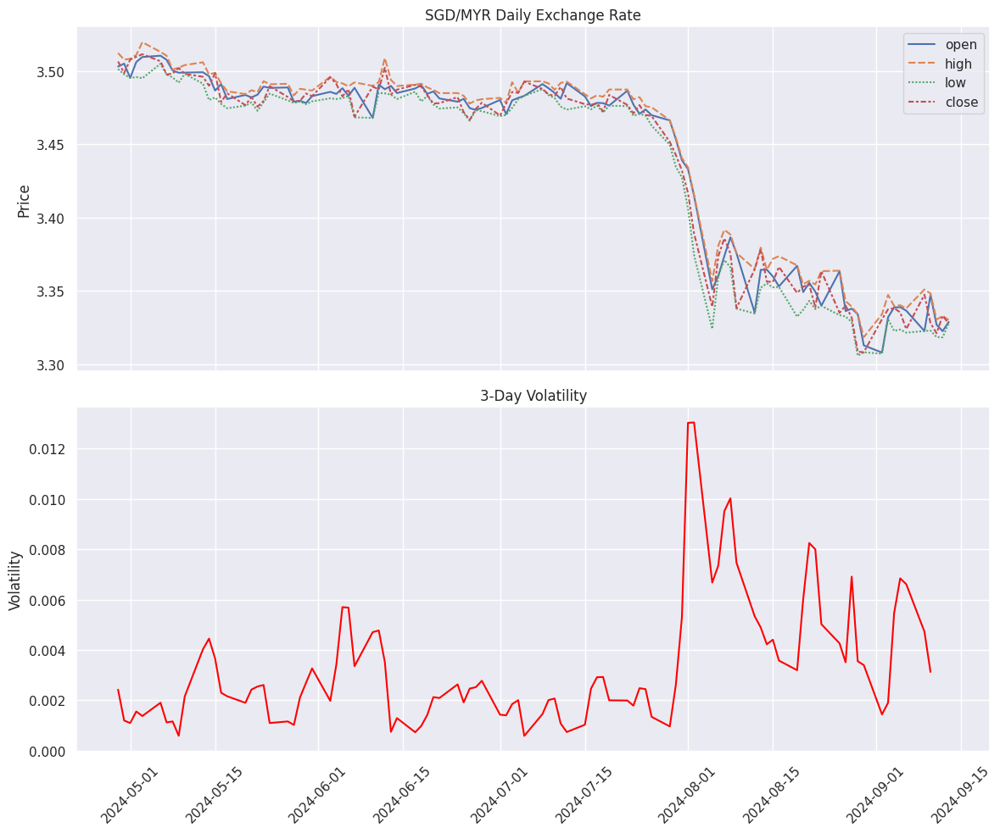
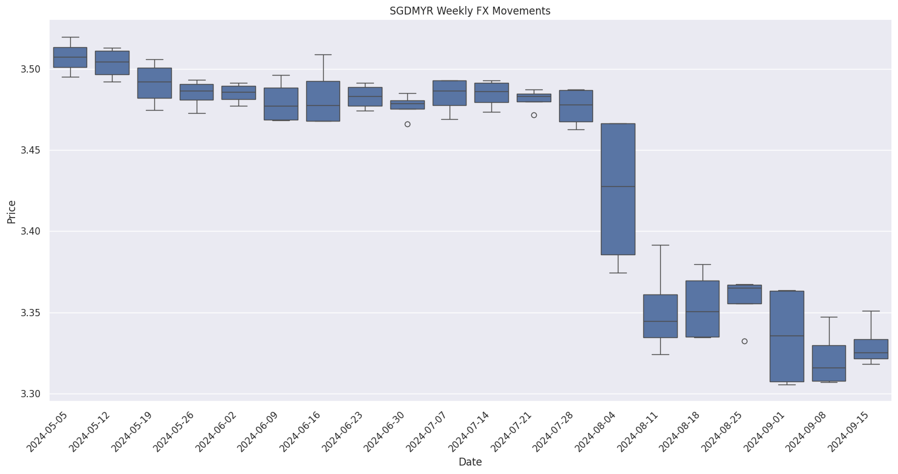

# Living the Good-Enough Life: lifestyle arbitrage through FX

Lets start with the problem statement... here's a basic scenario:

1. You have to move a non-trivial sum of $$ from SGD to MYR. 
2. This has to happen within the next 12 months. 

As the responsible adult, you want to maximize the work done by this capital in the whole process. Basically, tou want to maximize the net capital gain such that:

$
y = t \cdot r_1 + (d-t) \cdot r_2(p) + e
$

where:
- $y$: net gain (in %)
- $t$: time period of time in SGD (in days)
- $d$: total period of time till funds in needed (in days)
- $r_1$: rate of return in SGD (in days)
- $r_2: P \rightarrow \mathbb{R}$, where $P = \{p_1, p_2, ..., p_n\}$ is a finite set of investment products, and $r_2(p)$ is the daily rate of return in MYR for product $p \in P$
- $e$: exchange rate change from present rate (assumed to be SGD→MYR 3.35)

Therefore:
1) Solve for $t$: when should you exchange the currency?
2) solve for $P$: what investment product to use when its in MYR?

You are starting to sweat. This decision feels like a game of luck because WHO KNOWS WHAT THE FUTURE HOLDS?! 

## Understanding the Variables

### $e$: Exchange Rate Volatility and Projections 

**FX Patterns**

The first step is understanding the problem: how volatile are the FX rates? What exactly is at stake? 

Daily FX since April 2025. 
Volatility

**Expert Projections**

k

### $r$: Expected Returns from Investment Products

## Building a Model
