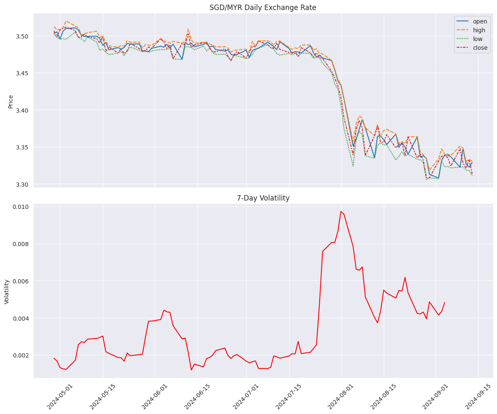

# Living the Good-Enough Life: lifestyle arbitrage through FX

## Whats the story?
Here's a basic story:

1. I have to move a non-trivial sum of $$ from SGD to MYR. 
2. This has to happen within the next $d$ months. 
3. When not used, the funds will be in some kind of financial product.

Breaking it down, there are 3 key components to this story:
- **SGD  Returns** : $t \cdot r_1$: This represents the returns if we keep the money in SGD for time $t$.
- **MYR Returns** : $(d-t) \cdot r_2(p)$: This is the returns from investing in MYR after exchanging at time $t$.
- **Exchange Rate Returns** : $\Delta e$: This captures the impact of exchange rate fluctuations.

Of course, I want to maximize the work done by this capital in the whole process. The net capital gain can be expressed as:
$$
y = t \cdot r_1 + (d-t) \cdot r_2(p) + \Delta e
$$

Where:
- $y$: net capital gain (%)
- $t$: annualized duration of funds in SGD, simplified to 3 time horizons:
  - $t \in \{0. 0.25, 0.5\}$
- $d$: annualized duration until funds needed, where $d=0.5$
- $r_1$: annualized rate of return in SGD fund
- $r_2(p)$: annualized rate of return in MYR for product $p \in P$
  - $r_2: P \to \mathbb{R}$
  - $P = \{\text{money\_market}, \text{bonds}, \text{fixed\_deposit}\}$
- $\Delta e$: percentage change in exchange rate from present rate, caluclated as:$\frac{e_t - e_0}{e_0} \times 100\%$
  - $e_t$ is the exchange rate at time $t$
  - $e_0$ is the present exchange rate at time of solving. 

For simplicity, I disregard transfer and service fees because they're relatively small here. 
Overall, I think this captures it? Cool. Lets move on to turn this into an optimization problem.

## What am I solving?

To maximize the net gain $y$, two key decisions need to be made:
1. When do I make FX transfer? ($t$)
2. What product do I use after the FX transfer? ($p$)

Re-written in principled form:
$$
\max_{t,p} y(t,p) = t \cdot r_1 + (d-t) \cdot r_2(p) + \Delta e
$$

Subject to:
- $t \in \{0, 0.25, 0.5\}$
- $p \in P = \{\text{money\_market}, \text{fixed\_deposit}\}$
- $0 \leq t \leq d$
- $d = 0.5$

The challenge is $\Delta e$ which is highly volatile at present. 
Charting out the FX movements for the past 100 days: 


## How do I solve this? 

Steps to Solve
1. Model exchange rate $\Delta e$ using Bayesian methods for $t \in \{0, 0.25, 0.5\}$
2. Estimate $r_1$ and $r_2(p)$ for each $p \in P$
3. Formulate as a discrete optimization problem
4. Solve for optimal $(t^*, p^*)$ using exhaustive search or monte-carlo methods:
   - For each $t \in \{0, 0.25, 0.5\}$ and $p \in P$, calculate $y(t,p)$
   - Select $(t^*, p^*)$ that maximizes $y(t,p)$
5. Conduct sensitivity analysis on key parameters
6. Validate results with historical data and out-of-sample testing

You are starting to sweat. This decision feels like a game of luck because WHO KNOWS WHAT THE FUTURE HOLDS?! 

## Task 1: Build model for $\Delta e$

### $e$: Exchange Rate Volatility and Projections 

**FX Patterns**

The first step is understanding the problem: how volatile are the FX rates? What exactly is at stake? 


Daily FX since April 2025. 
Volatility is within the bandwidth of 0.4%


**Expert Projections**

Here are the various expert opinions:

```python
# max, min, expected

dads_friend = (3.30, 3.35, 3.33)
hsbc_rm = (3.25, 3.40, 3.35)
bloomberg_futures = (3.33, 3.34, 3.335)

```

### $r$: Expected Returns from Investment Products

## Building a Model
